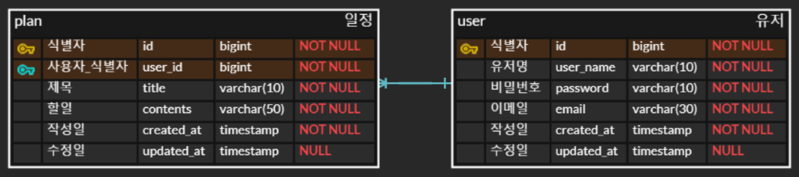
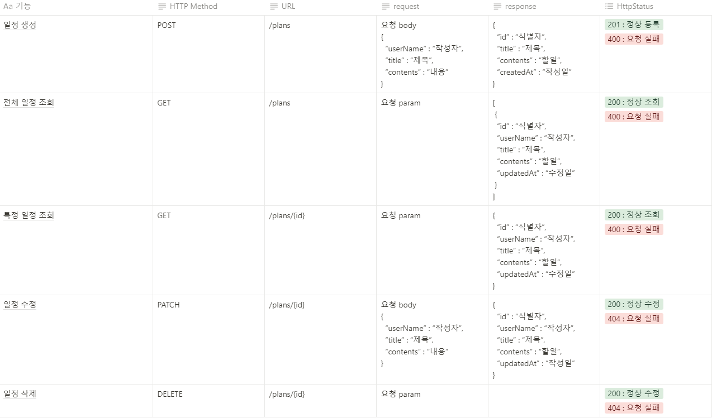
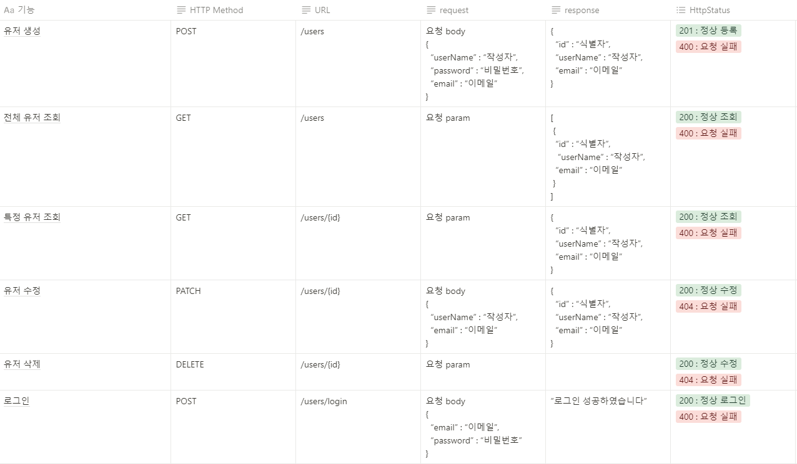

# **일정관리 과제 with JPA - Plan**

## ERD
+ ERD의 경우 erdCloud(https://www.erdcloud.com/)을 활용하였습니다

## PLAN API 명세서

## USER API 명세서

## 요구사항

### Lv 0
+ API 명세서 작성하기
+ ERD 작성하기
+ SQL 작성하기

### Lv 1

### Lv 2

### Lv 3

### Lv 4

## Package 분리

## 구현기능

### 1. POST

### 2. GET

### 3. PATCH

### 4. DELETE

### 로그인

### 공통사항